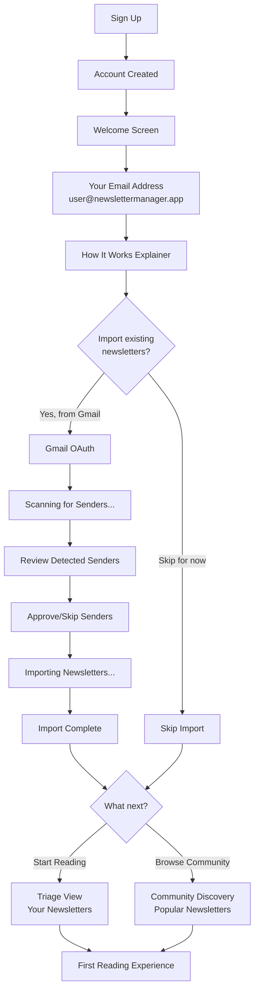
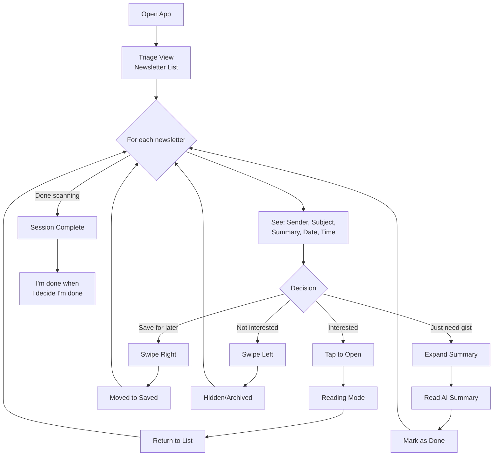
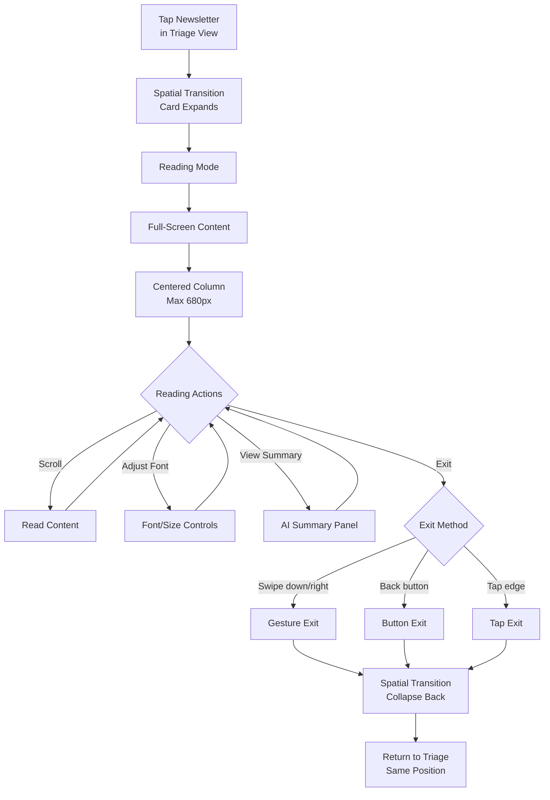
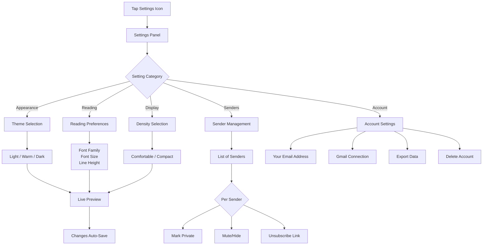

# UX Design Specification - Newsletter Manager

**Author:** Teogoulois
**Date:** 2026-01-22

---

## Executive Summary

### Project Vision

Newsletter Manager reimagines the relationship between readers and their newsletter subscriptions. Rather than treating newsletters as another form of inbox clutter to manage, it creates a dedicated space where content waits patiently — no guilt, no pressure, no competition with urgent emails.

The core UX philosophy is **reading on your terms**: newsletters are there when you want them, invisible when you don't.

### Target Users

**Primary: The Newsletter Collector (Sarah)**
- Subscribes to 10-75+ newsletters across professional and personal interests
- Currently drowning — newsletters compete with work email for attention
- Wants separation, organization, and a way to actually read what they've subscribed to
- Tech-comfortable but values simplicity over power-user features
- Uses both desktop and mobile throughout the day

**Secondary: The Weekend Reader (Jordan)**
- Smaller newsletter diet (5-15 subscriptions)
- Ignores newsletters during the week, catches up in focused sessions
- Values calm, pressure-free experience
- Summaries help when time is limited

### Key Design Challenges

1. **Dual-mode reading experience** — Support both quick triage (scan subjects, decide what to read) and deep reading (focused, distraction-free consumption) as distinct UX modes

2. **Pressure-free design language** — Reinvent how we communicate "new content" without anxiety-inducing patterns like unread counts, notification badges, or "you're behind" messaging

3. **Responsive long-form reading** — Newsletter HTML was designed for email clients, not mobile screens. Must render beautifully across desktop and mobile without breaking layouts

4. **Discovery without overwhelm** — Community back-catalog is a feature, not a burden. Recommendations and search must surface relevant content without creating "infinite backlog" paralysis

5. **Complex onboarding simplification** — Gmail OAuth + sender detection + import approval + address migration is multi-step. Must feel effortless, not overwhelming

### Design Opportunities

1. **"Zen inbox" as brand differentiator** — A genuinely pressure-free reading experience doesn't exist in the market. Nail this and it becomes the reason people choose Newsletter Manager

2. **AI-assisted triage** — Summaries enable quick "worth reading?" decisions, making triage mode genuinely useful rather than just inbox management theater

3. **Reading-first architecture** — Optimize for the reading experience itself, not inbox zero. This is a reader, not an email client

4. **Community-powered discovery** — "Readers who enjoy X also subscribe to Y" transforms the back-catalog from overwhelming archive into personalized newsletter discovery

---

## Core User Experience

### Defining Experience

The Newsletter Manager experience is built around a **triage-first, reading-second** workflow. Users land in a view optimized for rapid decision-making — scanning subjects, spotting what's interesting, and flowing seamlessly into focused reading when something catches their attention.

The core loop:
1. **Scan** — Glance at what's new, see key info at a glance
2. **Decide** — Quick "worth reading?" judgment (AI summaries assist here)
3. **Flow** — Transition smoothly into distraction-free reading
4. **Return** — Exit reading and resume scanning without losing context

### Platform Strategy

- **Web-first** — Primary platform is responsive web (desktop + tablet + mobile browser)
- **Touch and mouse optimized** — Interactions work equally well with click, tap, or keyboard
- **Mobile app (post-MVP)** — Native apps via Expo for offline reading and push notifications
- **Progressive enhancement** — Core reading works everywhere; advanced features layer on top

### Effortless Interactions

Every interaction should feel like it takes less effort than expected:

| Interaction | Effortless Design |
|-------------|-------------------|
| **Triage scanning** | All key info visible without clicking — sender, subject, date, summary preview |
| **Opening a newsletter** | One click/tap, animated transition maintains spatial context |
| **Returning to list** | Swipe, gesture, or click — multiple natural paths back |
| **Marking as read** | Automatic on scroll completion, manual override available |
| **Getting AI summary** | Already generated, visible inline — no waiting |

**Animation philosophy:** Transitions connect actions visually. Elements expand, slide, and fade with purpose — never jarring cuts. Movement communicates spatial relationships and reduces cognitive load.

### Critical Success Moments

| Moment | What Success Feels Like |
|--------|-------------------------|
| **First scan** | "I can see everything I need to decide what to read" |
| **Opening a newsletter** | "That was instant — no loading spinner, no layout shift" |
| **Reading experience** | "This is cleaner than the original email, easier on my eyes" |
| **Returning to inbox** | "I'm exactly where I left off, nothing lost" |
| **End of session** | "I read what I wanted, guilt-free, and I'm done" |

### Experience Principles

1. **Triage-first architecture** — Default view optimizes for quick decisions, not deep reading
2. **Minimal interaction cost** — Every action requires fewer clicks/taps than users expect
3. **Animated continuity** — Smooth transitions maintain spatial awareness and reduce cognitive load
4. **Information density without clutter** — Key info visible at a glance with intentional breathing room
5. **User agency** — Customizable typography and theme preferences; users own their reading experience

---

## Visual Foundation

### Typography Strategy

- **Primary font:** Clean, highly legible sans-serif optimized for fast scanning (Inter, Geist, or similar)
- **Reading font:** User-customizable — offer 3-4 presets (sans-serif, serif, monospace, dyslexia-friendly)
- **Type scale:** Clear hierarchy — headlines scannable, body text comfortable for long-form reading
- **Font size controls:** User-adjustable base size with relative scaling throughout

### Color Strategy

**Neutral Canvas Approach:**
- Content is the color — interface stays out of the way
- Clean whites and grays for backgrounds and containers
- Soft orange/amber accent for interactive elements (buttons, links, focus states)
- Semantic colors for status (success, error, warnings)

**Accent Color: Soft Orange / Amber**

| Context | Color | Usage |
|---------|-------|-------|
| **Light themes** | `#D97706` | Primary buttons, links, active states |
| **Dark theme** | `#FBBF24` | Lighter variant for contrast on dark backgrounds |
| **Hover/Focus** | `#B45309` / `#F59E0B` | Slightly darker/lighter for feedback |

*Rationale:* Warm, inviting, encourages engagement without urgency. Evokes "morning coffee reading" — friendly and personal. Distinctive in the reading app space.

**Theme Palette:**

| Theme | Background | Surface | Text | Accent |
|-------|------------|---------|------|--------|
| **Light** | `#FFFFFF` | `#F9FAFB` | `#111827` | `#D97706` |
| **Warm** | `#FFFBF5` | `#F5F3F0` | `#1C1917` | `#B45309` |
| **Dark** | `#0F0F0F` | `#1A1A1A` | `#E5E5E5` | `#FBBF24` |

**Semantic Colors:**

| Purpose | Light Theme | Dark Theme |
|---------|-------------|------------|
| **Success** | `#059669` | `#34D399` |
| **Error** | `#DC2626` | `#F87171` |
| **Warning** | `#D97706` (accent) | `#FBBF24` (accent) |
| **Info** | `#2563EB` | `#60A5FA` |

**Unread indicator:** Subtle use of accent color or a soft dot — never aggressive badge counts.

### Spacing & Rhythm

- **8px base unit** — All spacing derives from multiples of 8
- **Generous whitespace** — Reading content needs room to breathe
- **Consistent density** — Triage view is tighter; reading view is more spacious

---

## Desired Emotional Response

### Primary Emotional Goals

| Emotion | Description |
|---------|-------------|
| **Calm** | No pressure, no urgency. Content waits patiently. Users feel in control of their attention. |
| **Satisfied** | "I read what I wanted" — a sense of completion without exhaustion. |
| **Refreshed** | Reading here energizes rather than drains. It's a break, not a chore. |
| **Enriched** | The defining emotion — users feel intellectually nourished by diverse perspectives and new ideas. |

**The "tell a friend" moment:** "It's where I go to read things that make me think differently. And somehow I never feel behind."

### Emotional Journey Mapping

| Stage | Desired Emotion | Design Implication |
|-------|-----------------|-------------------|
| **Opening the app** | Calm anticipation | Clean, uncluttered landing. No badge counts screaming at you. |
| **Scanning newsletters** | Curious, unhurried | Triage view presents options without pressure. "What looks interesting today?" |
| **Reading** | Absorbed, enriched | Distraction-free reading mode. Content is the experience. |
| **Finishing a newsletter** | Satisfied, refreshed | Gentle transition back. No "next up" pressure. |
| **Leaving the app** | Complete, guilt-free | No unread counts haunting you. "I'm done when I decide I'm done." |
| **Returning later** | Welcome, not obligated | App greets you fresh. No "you've been away" guilt trips. |

### Emotions to Actively Avoid

| Anti-Emotion | How We Prevent It |
|--------------|-------------------|
| **Guilt** | No unread counts, no "you're behind" messaging, no streaks to maintain |
| **Anxiety** | No notification pressure, no urgency indicators, no "act now" patterns |
| **Overwhelm** | Smart defaults, progressive disclosure, manageable information density |
| **FOMO** | No algorithmic "you're missing out" prompts, no social comparison |

### Micro-Emotions in Interaction Design

| Moment | Micro-Emotion | Design Choice |
|--------|---------------|---------------|
| **Hovering over a newsletter** | Gentle curiosity | Subtle preview expansion, not aggressive tooltip |
| **Opening a newsletter** | Smooth anticipation | Animated transition flows naturally, no jarring jump |
| **Scrolling through content** | Absorbed focus | Reading mode removes all chrome, content breathes |
| **Reaching the end** | Quiet satisfaction | Soft ending indicator, no "share now!" pressure |
| **Generating AI summary** | Helpful efficiency | Instant display, feels like a personal assistant |
| **Marking as private** | Secure, respected | Clear confirmation, privacy feels protected |

### Emotional Design Principles

1. **Sanctuary over productivity** — This is a reading retreat, not a task list. Design for nourishment, not throughput.

2. **Patience as a feature** — Content waits for the user. Never create urgency where none exists.

3. **Completion is user-defined** — "Done" means whatever the user decides. No external judgment of reading habits.

4. **Enrichment over consumption** — Frame the experience around ideas and perspectives, not volume processed.

5. **Calm confidence** — Every interaction should reinforce that the user is in control and doing just fine.

---

## UX Pattern Analysis & Inspiration

### Inspiring Products Analysis

Rather than copying existing products, Newsletter Manager draws selective inspiration from proven patterns while deliberately rejecting the industry norm of feature accumulation.

**Pattern Sources:**

| Pattern | Inspiration | Application |
|---------|-------------|-------------|
| **Immersive Reading** | Safari Reader, Medium | Full-screen, distraction-free reading mode |
| **Spatial Animations** | iOS, Arc Browser | Elements flow and connect spatially, maintaining context |
| **View Flexibility** | Modern productivity apps | List and card views available, user chooses |

**Deliberate Non-Inspiration:**
The product intentionally avoids patterns from Notion (complexity), Readwise (feature density), and traditional email clients (inbox anxiety patterns).

### Transferable UX Patterns

**Reading Patterns:**
- **Immersive Reader Mode** — When opening a newsletter, all UI chrome disappears. Content fills the viewport. The reading experience is singular and focused.
- **Gentle Exit** — Swipe, gesture, or click to return. Multiple natural paths back to the list without losing position.

**View Patterns:**
- **List View (Default)** — Compact, scannable rows. Efficient for triage. Shows sender, subject, date, summary preview.
- **Card View (Optional)** — Visual cards with sender branding. More touch-friendly, better for browsing mood.
- **User Choice** — View preference persists. No forced defaults.

**Animation Patterns:**
- **Spatial Flow** — Elements expand from their origin point. Closing reverses the animation. User always knows "where they are" spatially.
- **Purposeful Motion** — Every animation communicates something. No motion for motion's sake.
- **Smooth Continuity** — Transitions connect states. Never jarring cuts or page reloads.

### Anti-Patterns to Avoid

| Anti-Pattern | Why It's Harmful | Our Alternative |
|--------------|------------------|-----------------|
| **"Mark all as read" pressure** | Creates guilt, implies you're behind | No unread counts. Reading state is personal, not performative. |
| **Infinite scroll** | Never-ending content creates anxiety, no sense of completion | Finite lists with clear boundaries. "You've seen everything new." |
| **Settings overload** | Paradox of choice, cognitive burden | Smart defaults, minimal configuration. Customization where it matters (fonts, themes). |
| **Social features** | Likes, comments, sharing create comparison and performance pressure | No social layer. Reading is personal. Share externally if desired. |
| **Algorithmic sorting** | Users lose control, can't find what they want | Chronological by default. User controls sort order. No hidden filtering. |
| **Notification pressure** | Push notifications create urgency and guilt | No push by default. Content waits patiently. |
| **Streaks and gamification** | Creates obligation, turns reading into a chore | No streaks, no badges, no "reading goals." |

### Design Inspiration Strategy

**Philosophy: Subtraction as a Feature**

Newsletter Manager succeeds not by adding more features than competitors, but by deliberately removing friction, pressure, and complexity.

**What to Adopt:**
- Immersive, distraction-free reading mode
- Spatial animations that maintain user orientation
- Flexible view options (list/card) based on user preference
- Chronological, predictable content ordering

**What to Adapt:**
- Reading progress indicators — use subtly, never as pressure
- AI summaries — helpful tool, never mandatory or intrusive

**What to Explicitly Avoid:**
- Unread counts and badges
- Infinite scroll patterns
- Social/sharing features
- Algorithmic curation
- Gamification (streaks, achievements)
- Aggressive notification strategies
- Complex settings and configuration

**Design Litmus Test:**
Before adding any feature, ask: "Does this create calm or anxiety? Does this give users control or take it away? Does this align with reading as enrichment, not obligation?"

---

## Design System Foundation

### Design System Choice

**Primary System:** shadcn/ui + Tailwind CSS + Base UI primitives

Newsletter Manager uses a headless, themeable design system approach that prioritizes customization and performance over opinionated defaults.

| Layer | Technology | Purpose |
|-------|------------|---------|
| **Primitives** | Base UI | Accessible, unstyled component foundations |
| **Components** | shadcn/ui | Pre-built, customizable React components |
| **Styling** | Tailwind CSS | Utility-first CSS with design tokens |
| **Animations** | Framer Motion / CSS | Spatial flow transitions |
| **Icons** | Lucide React | Consistent, minimal icon set |

### Rationale for Selection

| Factor | Why shadcn/ui + Tailwind |
|--------|--------------------------|
| **Neutral canvas goal** | Components are intentionally minimal — they don't impose visual opinions |
| **Theme flexibility** | CSS variables enable seamless light/warm/dark theme switching |
| **Animation freedom** | Headless components allow custom spatial flow animations |
| **Reading optimization** | Typography and spacing fully customizable for long-form content |
| **Developer experience** | Copy-paste components, full ownership, no black-box abstractions |
| **Performance** | No runtime CSS-in-JS overhead; Tailwind purges unused styles |
| **Accessibility** | Base UI primitives include ARIA patterns and keyboard navigation |

### Implementation Approach

**Component Strategy:**

| Component Type | Approach |
|----------------|----------|
| **Standard UI** (buttons, inputs, dialogs) | Use shadcn/ui components, customize theming |
| **Reading experience** (article renderer, typography) | Custom components optimized for newsletter content |
| **Navigation** (sidebar, tabs) | shadcn/ui base with custom animation layer |
| **Data display** (newsletter cards, lists) | Custom components using Tailwind utilities |

**Theme Implementation:**

```css
/* CSS Variables for theme switching */
:root {
  --background: 255 255 255;      /* #FFFFFF */
  --surface: 249 250 251;         /* #F9FAFB */
  --foreground: 17 24 39;         /* #111827 */
  --accent: 217 119 6;            /* #D97706 */
}

[data-theme="warm"] {
  --background: 255 251 245;      /* #FFFBF5 */
  --surface: 245 243 240;         /* #F5F3F0 */
  --foreground: 28 25 23;         /* #1C1917 */
  --accent: 180 83 9;             /* #B45309 */
}

[data-theme="dark"] {
  --background: 15 15 15;         /* #0F0F0F */
  --surface: 26 26 26;            /* #1A1A1A */
  --foreground: 229 229 229;      /* #E5E5E5 */
  --accent: 251 191 36;           /* #FBBF24 */
}
```

### Customization Strategy

**Design Tokens:**

| Token Category | Customization Level |
|----------------|---------------------|
| **Colors** | Fully custom (neutral canvas + soft orange accent) |
| **Typography** | Custom scale + user-selectable reading fonts |
| **Spacing** | 8px base unit, custom rhythm for reading vs. triage density |
| **Borders/Radius** | Subtle, minimal — rounded-lg default for warmth |
| **Shadows** | Minimal use — soft, diffused when needed |
| **Animations** | Custom spatial flow system (expand, slide, fade) |

**Custom Components Needed:**

| Component | Why Custom |
|-----------|------------|
| **NewsletterCard** | Unique layout for triage scanning |
| **ReadingView** | Immersive mode with custom typography controls |
| **SenderAvatar** | Newsletter sender branding display |
| **SummaryPreview** | AI summary inline display |
| **ThemeSwitcher** | Three-way theme toggle (light/warm/dark) |
| **FontSelector** | User font preference picker |

**Animation System:**

| Animation | Trigger | Implementation |
|-----------|---------|----------------|
| **Expand-to-read** | Opening newsletter | Scale + fade from card origin |
| **Collapse-to-list** | Closing reader | Reverse of expand |
| **List reorder** | Filtering/sorting | Layout animation with Framer Motion |
| **Hover preview** | Card hover | Subtle scale + shadow lift |
| **Theme transition** | Theme switch | Smooth color interpolation |

---

## Defining Core Experience

### The One-Liner

**"Read what matters, skip what doesn't."**

Newsletter Manager's defining experience is triage efficiency — enabling users to make fast, confident "worth reading?" decisions without friction.

### User Mental Model

**How users think about this:**
- "I have limited time and too many newsletters"
- "I want to quickly see what's worth my attention today"
- "Some newsletters I'll read fully, some I just need the gist, some I'll skip entirely"
- "Don't make me open things just to decide if I care"

**Current frustrations with alternatives:**
- Email clients force you to open each newsletter to evaluate it
- No preview of content value before committing time
- Unread counts create guilt rather than helping decisions
- No way to "get the gist" without reading the whole thing

**Mental model we're designing for:**
"My newsletter app is a smart filter that helps me spend reading time on what actually matters to me."

### Success Criteria

| Criteria | Measurement |
|----------|-------------|
| **Decision speed** | User can evaluate any newsletter in 2-3 seconds |
| **Confidence** | User feels certain about skip/read/later decisions |
| **No guilt** | Skipping feels like a valid, positive choice |
| **Completeness** | User can process entire queue without opening a single newsletter |
| **Satisfaction** | "I read what I wanted" feeling at end of session |

### Triage View Information Architecture

**Five elements visible for every newsletter:**

| Element | Purpose | Display |
|---------|---------|---------|
| **Sender** | Trust/interest signal — "Do I care about this source?" | Avatar + name, prominent |
| **Subject** | Topic signal — "Is this relevant to me right now?" | Primary text, scannable |
| **AI Summary** | Value signal — "What will I learn? Is it worth it?" | 1-2 line preview, expandable |
| **Date** | Freshness signal — "Is this timely or stale?" | Relative time (2h ago, Yesterday) |
| **Reading time** | Commitment signal — "Do I have time for this?" | "4 min read" badge |

**Layout principle:** Information density without clutter. All five visible at a glance, but hierarchy guides the eye: Sender → Subject → Summary → metadata.

### Triage Actions (Without Opening)

**Three quick actions available from list view:**

| Action | Gesture/UI | Result |
|--------|------------|--------|
| **Save for later** | Bookmark icon / swipe right | Moves to "Saved" — user's curated reading list |
| **Hide / Archive** | X icon / swipe left | Disappears from view — no guilt, no judgment |
| **Expand summary** | Tap summary area | Full AI summary appears inline — read the gist without opening |

**Design principle:** Every action is one gesture. No confirmation dialogs. Undo available for mistakes.

### Experience Mechanics

**1. Initiation — Opening the App:**
- User sees their newsletter list immediately
- No splash screen, no loading state visible (optimistic UI)
- List shows newest first, all five info elements visible per item

**2. Scanning — The Core Loop:**
- Eyes move down the list: Sender → Subject → Summary preview
- Brain makes instant "interested / not interested" judgment
- For "maybe" items, tap to expand full AI summary inline

**3. Decision — Acting on Each Item:**
- **Interested:** Tap to open → flows into immersive reading mode
- **Not now:** Swipe right to save → item moves to Saved list
- **Not interested:** Swipe left to hide → item fades away, no trace
- **Just need the gist:** Expand summary → read inline, mark as done

**4. Completion — End of Session:**
- User has processed their queue
- No unread count staring at them
- Clear sense of "I'm done when I decide I'm done"

### Novel vs. Established Patterns

| Aspect | Pattern Type | Notes |
|--------|--------------|-------|
| **List scanning** | Established | Familiar email/feed pattern |
| **Swipe actions** | Established | iOS Mail, Tinder — universally understood |
| **AI summary preview** | Novel | Unique value prop — competitors don't have this |
| **Inline summary expansion** | Novel | Read the gist without mode change |
| **No unread counts** | Novel | Counter to industry norms — deliberate absence |
| **Reading time estimate** | Emerging | Medium popularized this, becoming expected |

**Teaching required:** Minimal. Swipe gestures and list scanning are familiar. The novel elements (AI summaries, no pressure design) are additive benefits, not new skills to learn.

---

## Visual Design Foundation

### Typography System

**Primary Font: Geist**

| Usage | Font | Weight | Size |
|-------|------|--------|------|
| **UI / Navigation** | Geist Sans | 400-600 | 14-16px |
| **Headlines** | Geist Sans | 600-700 | 20-32px |
| **Body (triage)** | Geist Sans | 400 | 15-16px |
| **Body (reading)** | User-selected | 400 | 18-22px (user adjustable) |
| **Metadata** | Geist Sans | 400 | 12-14px |
| **Monospace** | Geist Mono | 400 | 14px |

**Type Scale (8px rhythm):**

| Level | Size | Line Height | Usage |
|-------|------|-------------|-------|
| **xs** | 12px | 16px | Timestamps, badges |
| **sm** | 14px | 20px | Secondary text, metadata |
| **base** | 16px | 24px | Body text, UI elements |
| **lg** | 18px | 28px | Emphasized body, reading mode |
| **xl** | 20px | 28px | Section headers |
| **2xl** | 24px | 32px | Page titles |
| **3xl** | 32px | 40px | Hero text (rare) |

**Reading Font Presets:**

| Preset | Font | Best For |
|--------|------|----------|
| **Sans-serif** (default) | Geist Sans | Clean, modern newsletters |
| **Serif** | Georgia / Merriweather | Long-form, editorial content |
| **Monospace** | JetBrains Mono | Code-heavy, technical newsletters |
| **Dyslexia-friendly** | OpenDyslexic | Accessibility preference |

**User Typography Controls:**
- Font family selection (4 presets)
- Base font size slider (16px - 24px)
- Line height preference (normal / relaxed)

### Spacing System

**Base Unit: 8px**

| Token | Value | Usage |
|-------|-------|-------|
| **space-1** | 4px | Tight gaps, icon padding |
| **space-2** | 8px | Standard element spacing |
| **space-3** | 12px | Related element groups |
| **space-4** | 16px | Section padding |
| **space-6** | 24px | Card padding, major gaps |
| **space-8** | 32px | Section separation |
| **space-12** | 48px | Page section margins |
| **space-16** | 64px | Major layout divisions |

### Layout Density Options

**User-selectable density modes:**

| Mode | Newsletter Card Height | Items Visible (Desktop) | Touch Target |
|------|------------------------|-------------------------|--------------|
| **Comfortable** | ~120px | 5-6 newsletters | 48px minimum |
| **Compact** | ~80px | 8-10 newsletters | 40px minimum |

**Density affects:**
- Card vertical padding
- Summary preview length (2 lines vs 1 line)
- Metadata visibility (compact may hide reading time)
- Touch/click target sizes

**Default:** Comfortable on mobile, user's last choice on desktop.

### Layout Structure

**Responsive Breakpoints:**

| Breakpoint | Width | Layout |
|------------|-------|--------|
| **Mobile** | < 640px | Single column, full-width cards |
| **Tablet** | 640-1024px | Single column, padded cards |
| **Desktop** | > 1024px | Optional sidebar + content area |

**Reading Mode Layout:**
- **Mobile:** Full-width, edge-to-edge content
- **Tablet/Desktop:** Centered column, max-width 680px for optimal reading line length
- **No sidebar in reading mode** — full immersion

### Color System (Consolidated)

**Theme Tokens:**

| Token | Light | Warm | Dark |
|-------|-------|------|------|
| **--background** | #FFFFFF | #FFFBF5 | #0F0F0F |
| **--surface** | #F9FAFB | #F5F3F0 | #1A1A1A |
| **--surface-elevated** | #FFFFFF | #FFFFFF | #262626 |
| **--foreground** | #111827 | #1C1917 | #E5E5E5 |
| **--foreground-muted** | #6B7280 | #78716C | #A3A3A3 |
| **--accent** | #D97706 | #B45309 | #FBBF24 |
| **--accent-hover** | #B45309 | #92400E | #F59E0B |
| **--border** | #E5E7EB | #E7E5E4 | #262626 |

**Semantic Colors:**

| Purpose | Light | Dark | Usage |
|---------|-------|------|-------|
| **Success** | #059669 | #34D399 | Saved confirmation, positive actions |
| **Error** | #DC2626 | #F87171 | Error states, destructive actions |
| **Warning** | #D97706 | #FBBF24 | Caution states (uses accent) |
| **Info** | #2563EB | #60A5FA | Informational highlights |

### Accessibility Considerations

**Contrast Requirements:**
- All text meets WCAG AA (4.5:1 for body, 3:1 for large text)
- Interactive elements have visible focus states
- Accent color tested against all theme backgrounds

**Motion Preferences:**
- Respect `prefers-reduced-motion` — disable spatial animations
- Provide instant transitions as fallback
- No motion required for functionality

**Readability:**
- Minimum body text: 16px
- Maximum line length: 75 characters (~680px)
- Adequate line height (1.5-1.75 for reading)
- User control over font size and family

**Touch Accessibility:**
- Minimum touch target: 44x44px (comfortable mode)
- Adequate spacing between interactive elements
- Swipe gestures have button alternatives

---

## Design Direction Decision

### Design Direction Summary

Newsletter Manager follows a **"Calm Efficiency"** design direction — a neutral, reading-optimized interface that prioritizes fast triage and immersive reading without visual noise or pressure.

**Design Philosophy:**
- Interface disappears; content shines
- Warm accents invite action without urgency
- Spatial animations create flow and orientation
- User customization for personal reading comfort

### Visual Identity

| Attribute | Direction |
|-----------|-----------|
| **Overall Feel** | Clean, warm, minimal — like a well-designed reading nook |
| **Color Strategy** | Neutral canvas with soft orange accent for warmth |
| **Typography** | Geist Sans — modern, highly legible, tech-forward |
| **Density** | User-controlled (comfortable vs compact) |
| **Motion** | Purposeful spatial animations, never decorative |
| **Chrome** | Minimal — UI elements recede, content advances |

### Key Visual Decisions

**Triage View:**
- List-based layout (cards optional)
- Five info elements per newsletter (sender, subject, summary, date, reading time)
- Swipe actions for quick decisions
- Inline summary expansion without mode change
- No unread badges or counts

**Reading View:**
- Full immersion — all chrome disappears
- Centered content column (max 680px)
- User-selected font family and size
- Smooth spatial transition from list item

**Theme Application:**
- Light theme: Clean whites, crisp contrast
- Warm theme: Cream tones, softer on eyes
- Dark theme: True dark, amber accent pops

### Design Rationale

| Decision | Why |
|----------|-----|
| **Neutral canvas** | Content (newsletters) provides visual variety; UI stays consistent |
| **Soft orange accent** | Warm, inviting, distinctive — "morning coffee" energy without urgency |
| **Geist font** | Modern yet readable; pairs well with newsletter content typography |
| **Spatial animations** | Maintains user orientation; reinforces "flow" between triage and reading |
| **No badges/counts** | Core emotional goal — eliminate guilt and pressure patterns |
| **User density control** | Respects different user preferences and device contexts |

### Implementation Approach

**Phase 1: Core Components**
- NewsletterCard (list item with all 5 info elements)
- ReadingView (immersive article renderer)
- ThemeSwitcher (3-way toggle)
- Swipe action handlers

**Phase 2: Customization**
- FontSelector component
- DensityToggle component
- Reading preferences panel

**Phase 3: Polish**
- Spatial animation system (Framer Motion)
- Theme transition smoothing
- Reduced motion fallbacks

---

## User Journey Flows

### Journey 1: New User Onboarding

**Goal:** Get user from sign-up to their first reading experience with minimal friction.

**Flow Philosophy:**
- Lead with value (your new email address)
- Educate on the "why" (declutter your inbox)
- Gmail import is optional, not required
- Community browsing provides immediate value



**Screen Breakdown:**

| Screen | Purpose | Key Elements |
|--------|---------|--------------|
| **Welcome** | Celebrate signup, build anticipation | "You're in!" messaging, warm tone |
| **Your Email** | Show dedicated address prominently | Large, copyable email, explanation |
| **How It Works** | Educate on value prop | 3-step visual: Forward → Arrives here → Read in peace |
| **Gmail Import** | Optional shortcut | Clear "skip" option, no pressure |
| **Sender Review** | User control over what imports | Checkboxes, sender logos, newsletter counts |
| **Import Progress** | Feedback during import | Progress bar, "X newsletters imported" |
| **What's Next** | Clear paths forward | Two equal options: "Your newsletters" / "Browse community" |

**Onboarding Principles:**
- Never block progress — every step has a skip option
- Show immediate value before asking for permissions
- Community browsing = instant gratification even with zero imports
- Warm, encouraging tone throughout

---

### Journey 2: Daily Triage

**Goal:** User efficiently processes their newsletter queue, deciding what to read, save, or skip.

**Flow Philosophy:**
- Triage-first, reading-second
- All decisions possible without opening
- No pressure, no guilt



**Triage Interactions:**

| Action | Gesture | Result | Feedback |
|--------|---------|--------|----------|
| **Open newsletter** | Tap card | Enter reading mode | Spatial expand animation |
| **Save for later** | Swipe right | Move to Saved list | Card slides right, bookmark icon |
| **Hide/Archive** | Swipe left | Remove from view | Card fades out |
| **Expand summary** | Tap summary area | Show full AI summary inline | Smooth expand animation |
| **Undo** | Tap undo toast | Reverse last action | Card reappears |

---

### Journey 3: Reading Session

**Goal:** User reads newsletter content in a focused, distraction-free environment.

**Flow Philosophy:**
- Full immersion — UI disappears
- User controls the experience (font, size)
- Gentle exit, no "next up" pressure



**Reading Mode Elements:**

| Element | Visibility | Purpose |
|---------|------------|---------|
| **Newsletter content** | Always | The reading experience |
| **Scroll progress** | Subtle bar | Orientation without pressure |
| **Font controls** | On tap/hover | User customization |
| **Exit affordance** | Minimal | Multiple exit paths |
| **AI summary** | On demand | Quick reference |

**Reading Principles:**
- No header/footer chrome while reading
- Multiple exit methods (swipe, tap, button)
- Return to exact list position
- Auto-mark as read on 80% scroll (optional)

---

### Journey 4: Settings & Preferences

**Goal:** User customizes their reading experience (theme, fonts, density, sender management).

**Flow Philosophy:**
- Settings that matter, nothing more
- Live preview where possible
- Respect user agency



**Settings Categories:**

| Category | Options | Notes |
|----------|---------|-------|
| **Appearance** | Light / Warm / Dark theme | Live preview, respects system preference option |
| **Reading** | Font (4 presets), Size (slider), Line height | Live preview in sample text |
| **Display** | Comfortable / Compact density | Affects triage view |
| **Senders** | Per-sender privacy, mute, unsubscribe links | Management, not inbox-style controls |
| **Account** | Email address, Gmail connection, data export | Standard account management |

---

### Journey 5: Community Discovery

**Goal:** User browses newsletters from the community database to discover new content.

```mermaid
flowchart TD
    A[Tap "Discover" or<br/>"Browse Community"] --> B[Community View]

    B --> C{Browse Method}

    C -->|"Popular"| D[Trending Newsletters]
    C -->|"Categories"| E[Browse by Topic]
    C -->|"Similar"| F["Readers of X<br/>also like Y"]

    D --> G[Newsletter Preview]
    E --> G
    F --> G

    G --> H{Action}

    H -->|"Read Issue"| I[Reading Mode<br/>Community Content]
    H -->|"Subscribe"| J[Add to Your Feed]
    H -->|"Back"| B

    I --> K[Enjoyed?]
    K -->|"Yes"| L[Prompt: Subscribe?]
    L --> B
    K -->|"Not for me"| B
```

**Community Features:**

| Feature | Purpose |
|---------|---------|
| **Trending** | Surface popular newsletters across all users |
| **Categories** | Browse by topic (Tech, Business, Culture, etc.) |
| **Recommendations** | "Readers who enjoy X also subscribe to Y" |
| **Preview before subscribe** | Read an issue before committing |

---

### Flow Optimization Principles

**Across All Journeys:**

| Principle | Application |
|-----------|-------------|
| **Minimum viable friction** | Every flow has the shortest path to success |
| **Always skippable** | No forced steps; user controls pace |
| **Undo everywhere** | Mistakes are recoverable, not punished |
| **Spatial continuity** | Transitions show where you came from and where you're going |
| **Progressive disclosure** | Show what's needed now; reveal complexity on demand |
| **No dead ends** | Every screen has a clear next action |

**Error Handling Pattern:**

| Error Type | Response |
|------------|----------|
| **Network failure** | Offline indicator + cached content + retry when back |
| **Import failure** | Graceful partial success, clear retry option |
| **OAuth revoked** | Gentle prompt to reconnect, no data loss |
| **Content load failure** | Skeleton → error state → retry button |
